# Comprehensive Brain Fingerprinting Analysis Report

**Generated on:** 2026-01-25 12:02:08 (Updated post-review)

## 1. Methodology & Metrics Explanation

### A. Evaluation Metrics
- **Identification Accuracy (Top-1):** The percentage of subjects in verify session correctly identified from the database (Rank-1).
- **Top-5 Accuracy:** The percentage of times the correct subject is present within the top 5 predicted matches.
- **Mean Reciprocal Rank (MRR):** A statistic measure for evaluating the return of a ranked list of answers. MRR is 1 if the first result is correct, 0.5 if second, etc.
- **Differential Identifiability:** The gap between the mean intra-subject similarity ($I_{self}$) and mean inter-subject similarity ($I_{others}$). Higher is better, indicating stronger separation between subjects.

### B. Statistical Validation Methods
- **Permutation Test (for Unsupervised Significance):**  
  Since the identification is unsupervised, we validate that the high accuracy is not due to random chance. We randomly shuffle the subject labels of the target session 1000 times and re-calculate the identification accuracy. This builds a null distribution of "chance" accuracies. A p-value < 0.05 indicates our result is statistically significant and not a random artifact.
  
- **McNemar Test:**  
  A paired non-parametric statistical hypothesis test used to compare the performance of two machine learning models (Proposed vs. Baseline) on the same set of subjects. It specifically analyzes the contingency table of correct/incorrect predictions. It focuses on subjects where the two models *disagree* (i.e., one is correct and the other is wrong). A **p-value < 0.05** confirms that the improvement in accuracy is statistically robust and not due to variance in the test set.

- **Bootstrap Confidence Intervals:**  
  We estimate the variability of our accuracy metric by resampling the test set (subjects) with replacement 1000 times. We report the 95% Confidence Interval (CI), providing a range of likely values for the true population accuracy.

### C. Baselines & Models
- **raw_fc / finn_2015:** The standard functional fingerprinting baseline using Pearson correlation of whole-brain functional connectivity matrices (Finn et al., 2015).
- **edge_sel_Xpct:** A strong baseline that effectively performs feature selection by keeping only the top X% of edges with the highest discriminative power (differential identifiability) across the population.
- **group_avg:** A simple baseline comparing subjects to the group mean (expected to be low).
- **convae_residuals:** Identification using the reconstruction error of the Autoencoder alone (without SDL). This tests if the AE's residuals are meaningful.
- **sdl_only:** Identification using Dictionary Learning on raw data (without the Autoencoder). This tests if the AE is necessary.
- **Proposed (convae_sdl):** The full proposed architecture utilizing Latent Reconstruction Error from the ConVAE-SDL pipeline.

### D. Robustness Metrics
- **Noise Robustness:** Evaluates model performance when increasing levels of Gaussian noise (feature-independent) are added to the input time series ($ \sigma \in [0, 0.3] $).
- **Sample Size Robustness:** Evaluates how the identification rate scales as the number of subjects ($N$) in the database increases. Harder tasks typically show degrading performance as $N$ grows.

---

## 2. Aggregate Performance Summary

| Task | Proposed Acc | Baseline Acc | Improvement | MRR | Diff. Ident. |
|---|---|---|---|---|---|
| SOCIAL | 0.7935 | 0.3363 | +135.95% | 0.8381 | 0.1073 |
| MOTOR | 0.7788 | 0.3569 | +118.21% | 0.8412 | 0.0976 |
| WM | 0.7640 | 0.4174 | +83.04% | 0.8232 | 0.1081 |
| EMOTION | 0.7404 | 0.2817 | +162.83% | 0.8004 | 0.0861 |
| GAMBLING | 0.7139 | 0.3230 | +121.02% | 0.7816 | 0.0933 |
| LANGUAGE | 0.8201 | 0.3510 | +133.65% | 0.8658 | 0.0978 |
| RELATIONAL | 0.6844 | 0.2301 | +197.44% | 0.7587 | 0.0844 |
| **AVERAGE** | **0.7564** | **0.3281** | **+136.02%** | **0.8156** | **0.0964** |

---

## 3. Detailed Task Analysis

### 3.1 Task: SOCIAL
#### A. Comprehensive Metrics
| Metric | Value |
|---|---|
| Top-1 Accuracy | 0.7935 |
| Top-3 Accuracy | 0.8643 |
| Top-5 Accuracy | 0.8909 |
| Top-10 Accuracy | 0.9322 |
| Mean Rank | 5.64 |
| Mean Reciprocal Rank | 0.8381 |
| Differential Identifiability | 0.1073 |

#### B. Ablation Study (Component Analysis)
| Method | Accuracy | Top-5 | MRR |
|---|---|---|---|
| raw_fc | 0.2802 | 0.4307 | 0.3540 |
| group_avg | 0.5752 | 0.7699 | 0.6620 |
| sdl_only | 0.0118 | 0.0501 | 0.0438 |
| convae_latent | 0.0413 | 0.0973 | 0.0816 |
| convae_residuals | 0.4041 | 0.5369 | 0.4756 |
| convae_sdl | 0.7935 | 0.8909 | 0.8381 |

#### C. State-of-the-Art Comparison
| Method | Accuracy |
|---|---|
| finn_2015 | 0.3363 |
| edge_sel_5pct | 0.2419 |
| edge_sel_10pct | 0.3068 |
| edge_sel_20pct | 0.3540 |
| proposed | 0.7935 |

#### D. Statistical Validation
| Test | Result | Interpretation |
|---|---|---|
| Bootstrap Mean | 0.1946 +/- 0.0143 | Stability of the mean |
| 95% CI | [0.1681, 0.2242] | Reliability range |
| Permutation Test | 0.001996 | **Significant** (p < 0.05) |
| McNemar Test | 0.000000 | **Significant** (p < 0.05) |

#### E. Robustness Analysis
**Noise Robustness (Accuracy vs Sigma):**
| Noise Level (Sigma) | Accuracy |
|---|---|
| sigma=0 | 0.2802 +/- 0.0000 |
| sigma=0.05 | 0.2802 +/- 0.0019 |
| sigma=0.1 | 0.2814 +/- 0.0030 |
| sigma=0.2 | 0.2779 +/- 0.0047 |
| sigma=0.3 | 0.2785 +/- 0.0055 |

**Sample Size Robustness (Accuracy vs N):**
| Sample Size (N) | Accuracy |
|---|---|
| N=67 | 0.3970 +/- 0.0407 |
| N=135 | 0.3096 +/- 0.0258 |
| N=203 | 0.3251 +/- 0.0149 |
| N=271 | 0.2989 +/- 0.0126 |
| N=339 | 0.2802 +/- 0.0000 |

#### F. Visualizations
- **Reconstruction Similarity Matrix:** 
- **Ablation Study:** 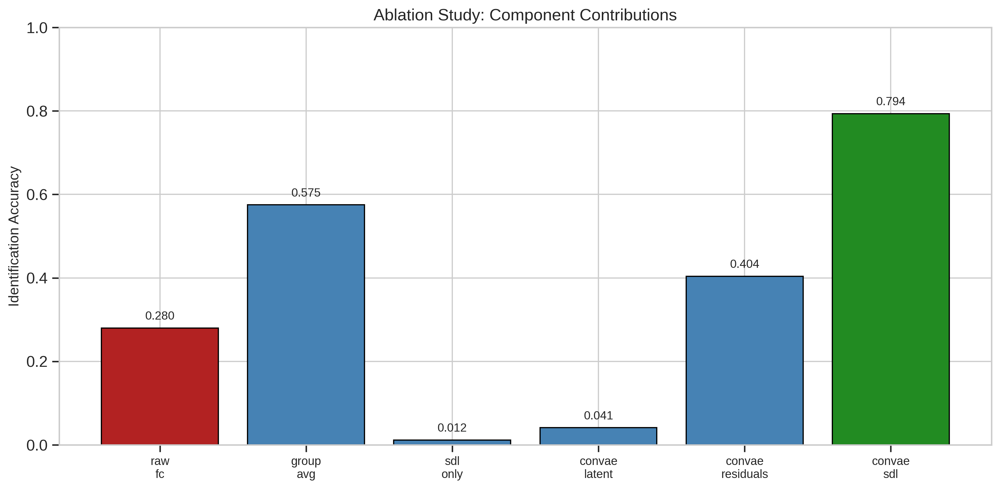
- **Robustness Analysis:** 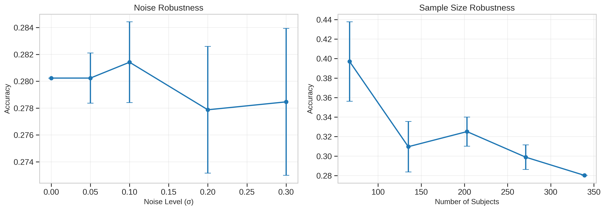
- **Learned Dictionary Atoms:** 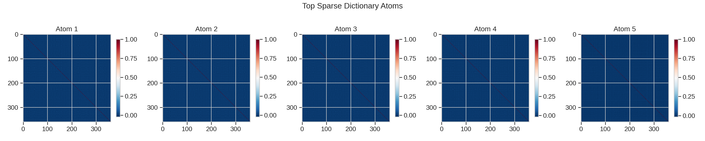
- **Similarity Distributions:** 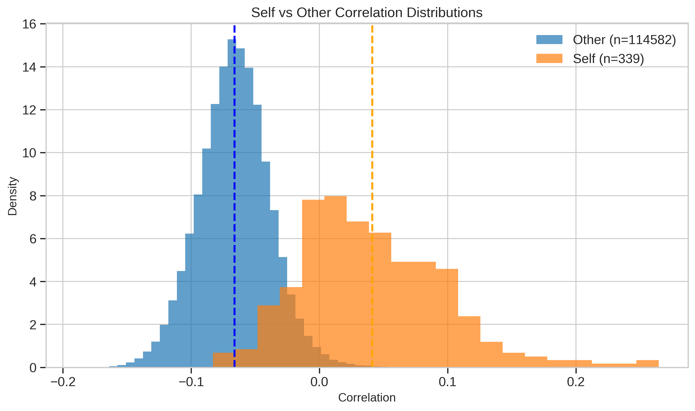

---

### 3.2 Task: MOTOR
#### A. Comprehensive Metrics
| Metric | Value |
|---|---|
| Top-1 Accuracy | 0.7788 |
| Top-3 Accuracy | 0.8879 |
| Top-5 Accuracy | 0.9174 |
| Top-10 Accuracy | 0.9410 |
| Mean Rank | 5.35 |
| Mean Reciprocal Rank | 0.8412 |
| Differential Identifiability | 0.0976 |

#### B. Ablation Study
| Method | Accuracy | Top-5 | MRR |
|---|---|---|---|
| raw_fc | 0.2802 | 0.4484 | 0.3603 |
| group_avg | 0.5841 | 0.7463 | 0.6587 |
| sdl_only | 0.0088 | 0.0560 | 0.0448 |
| convae_latent | 0.0590 | 0.1475 | 0.1099 |
| convae_residuals | 0.4690 | 0.6372 | 0.5520 |
| convae_sdl | 0.7788 | 0.9174 | 0.8412 |

#### C. State-of-the-Art Comparison
| Method | Accuracy |
|---|---|
| finn_2015 | 0.3569 |
| edge_sel_5pct | 0.3274 |
| edge_sel_10pct | 0.3392 |
| edge_sel_20pct | 0.3392 |
| proposed | 0.7788 |

#### D. Statistical Validation
| Test | Result | Interpretation |
|---|---|---|
| Bootstrap Mean | 0.1967 +/- 0.0161 | Stability of the mean |
| 95% CI | [0.1681, 0.2301] | Reliability range |
| Permutation Test | 0.001996 | **Significant** (p < 0.05) |
| McNemar Test | 0.000000 | **Significant** (p < 0.05) |

#### E. Robustness Analysis
**Noise Robustness:**
| Noise Level (Sigma) | Accuracy |
|---|---|
| sigma=0 | 0.2802 +/- 0.0000 |
| sigma=0.05 | 0.2808 +/- 0.0022 |
| sigma=0.1 | 0.2832 +/- 0.0032 |
| sigma=0.2 | 0.2832 +/- 0.0032 |
| sigma=0.3 | 0.2832 +/- 0.0046 |

**Sample Size Robustness:**
| Sample Size (N) | Accuracy |
|---|---|
| N=67 | 0.3791 +/- 0.0439 |
| N=135 | 0.3467 +/- 0.0571 |
| N=203 | 0.3291 +/- 0.0210 |
| N=271 | 0.2974 +/- 0.0101 |
| N=339 | 0.2802 +/- 0.0000 |

#### F. Visualizations
- **Reconstruction Similarity Matrix:** 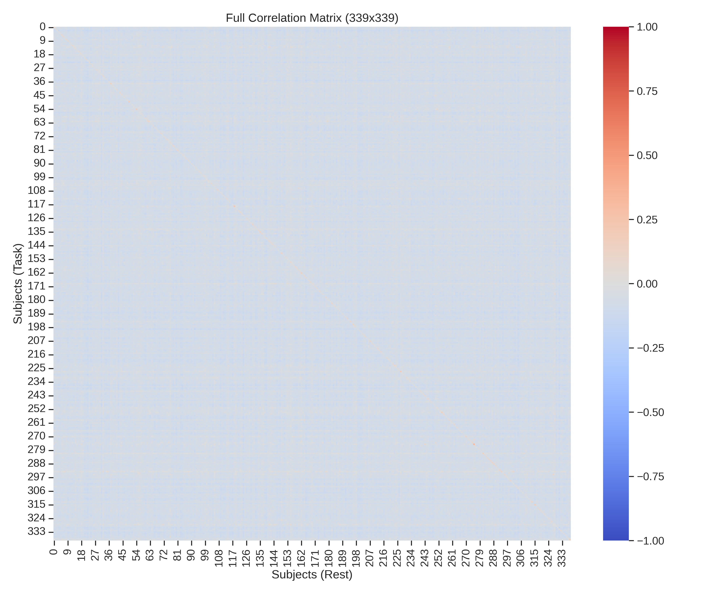
- **Ablation Study:** 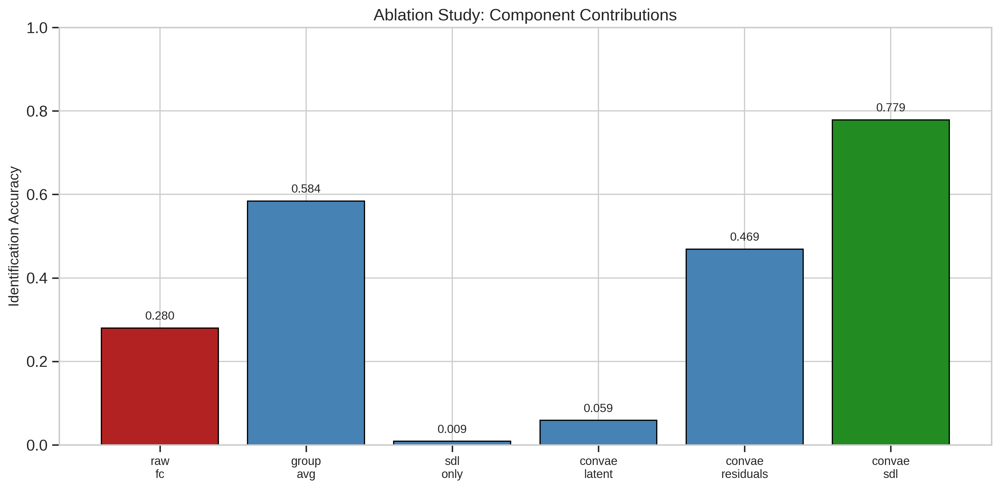
- **Robustness Analysis:** 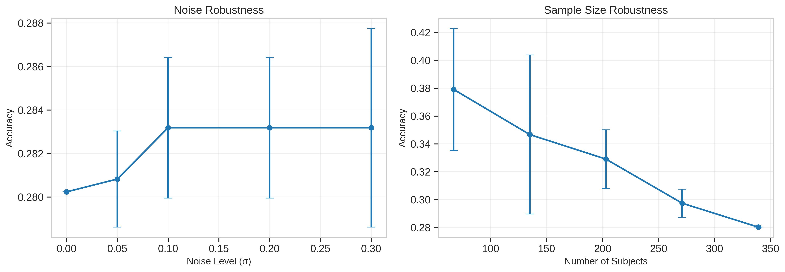
- **Learned Dictionary Atoms:** 
- **Similarity Distributions:** 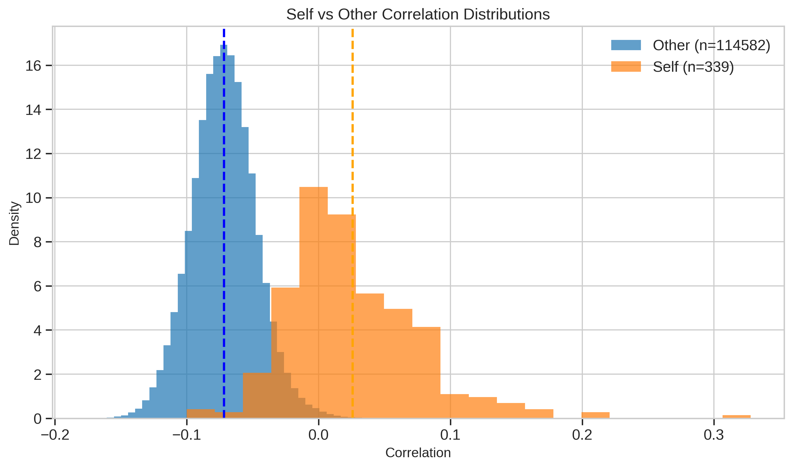

---

### 3.3 Task: WM
#### A. Comprehensive Metrics
| Metric | Value |
|---|---|
| Top-1 Accuracy | 0.7640 |
| Top-3 Accuracy | 0.8614 |
| Top-5 Accuracy | 0.9027 |
| Top-10 Accuracy | 0.9263 |
| Mean Rank | 7.35 |
| Mean Reciprocal Rank | 0.8232 |
| Differential Identifiability | 0.1081 |

#### B. Ablation Study
| Method | Accuracy | Top-5 | MRR |
|---|---|---|---|
| raw_fc | 0.3835 | 0.5339 | 0.4556 |
| group_avg | 0.5575 | 0.7286 | 0.6392 |
| sdl_only | 0.0442 | 0.0737 | 0.0717 |
| convae_latent | 0.0708 | 0.1416 | 0.1137 |
| convae_residuals | 0.5192 | 0.6932 | 0.6031 |
| convae_sdl | 0.7640 | 0.9027 | 0.8232 |

#### C. State-of-the-Art Comparison
| Method | Accuracy |
|---|---|
| finn_2015 | 0.4174 |
| edge_sel_5pct | 0.3215 |
| edge_sel_10pct | 0.3274 |
| edge_sel_20pct | 0.3569 |
| proposed | 0.7640 |

#### D. Statistical Validation
| Test | Result | Interpretation |
|---|---|---|
| Bootstrap Mean | 0.2591 +/- 0.0148 | Stability of the mean |
| 95% CI | [0.2301, 0.2891] | Reliability range |
| Permutation Test | 0.001996 | **Significant** (p < 0.05) |
| McNemar Test | 0.000000 | **Significant** (p < 0.05) |

#### E. Robustness Analysis
**Noise Robustness:**
| Noise Level (Sigma) | Accuracy |
|---|---|
| sigma=0 | 0.3835 +/- 0.0000 |
| sigma=0.05 | 0.3841 +/- 0.0012 |
| sigma=0.1 | 0.3864 +/- 0.0019 |
| sigma=0.2 | 0.3858 +/- 0.0043 |
| sigma=0.3 | 0.3864 +/- 0.0065 |

**Sample Size Robustness:**
| Sample Size (N) | Accuracy |
|---|---|
| N=67 | 0.5164 +/- 0.0601 |
| N=135 | 0.4237 +/- 0.0231 |
| N=203 | 0.4079 +/- 0.0336 |
| N=271 | 0.4007 +/- 0.0120 |
| N=339 | 0.3835 +/- 0.0000 |

#### F. Visualizations
- **Reconstruction Similarity Matrix:** 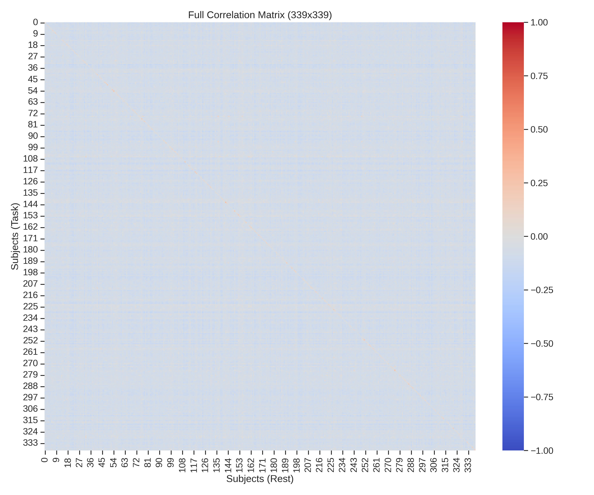
- **Ablation Study:** 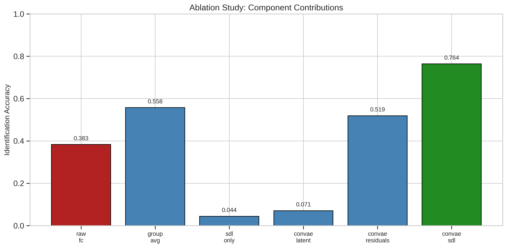
- **Robustness Analysis:** 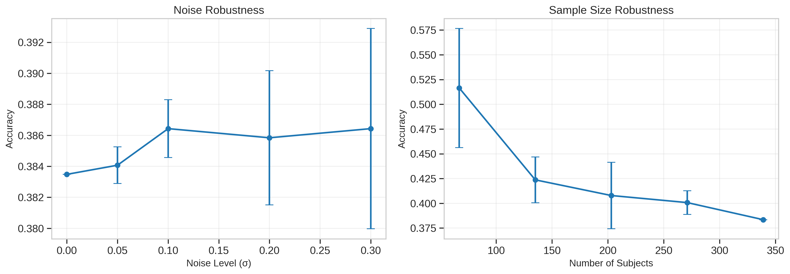
- **Learned Dictionary Atoms:** 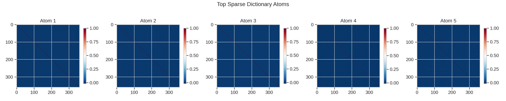
- **Similarity Distributions:** 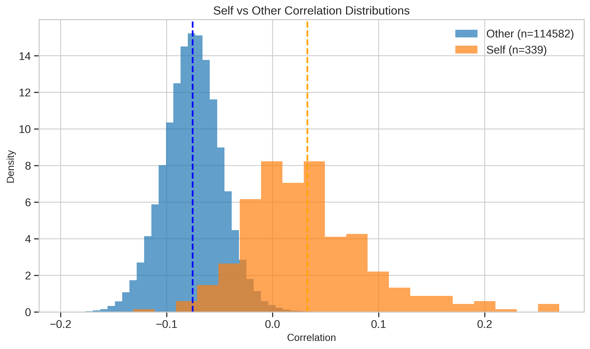

---

### 3.4 Task: EMOTION
#### A. Comprehensive Metrics
| Metric | Value |
|---|---|
| Top-1 Accuracy | 0.7404 |
| Top-3 Accuracy | 0.8496 |
| Top-5 Accuracy | 0.8702 |
| Top-10 Accuracy | 0.9115 |
| Mean Rank | 4.64 |
| Mean Reciprocal Rank | 0.8004 |
| Differential Identifiability | 0.0861 |

#### B. Ablation Study
| Method | Accuracy | Top-5 | MRR |
|---|---|---|---|
| raw_fc | 0.1947 | 0.3274 | 0.2670 |
| group_avg | 0.4454 | 0.6490 | 0.5479 |
| sdl_only | 0.0177 | 0.0472 | 0.0439 |
| convae_latent | 0.0206 | 0.0678 | 0.0531 |
| convae_residuals | 0.2861 | 0.4307 | 0.3609 |
| convae_sdl | 0.7404 | 0.8702 | 0.8004 |

#### C. State-of-the-Art Comparison
| Method | Accuracy |
|---|---|
| finn_2015 | 0.2817 |
| edge_sel_5pct | 0.1681 |
| edge_sel_10pct | 0.2006 |
| edge_sel_20pct | 0.2065 |
| proposed | 0.7404 |

#### D. Statistical Validation
| Test | Result | Interpretation |
|---|---|---|
| Bootstrap Mean | 0.1385 +/- 0.0157 | Stability of the mean |
| 95% CI | [0.1105, 0.1770] | Reliability range |
| Permutation Test | 0.001996 | **Significant** (p < 0.05) |
| McNemar Test | 0.000000 | **Significant** (p < 0.05) |

#### E. Robustness Analysis
**Noise Robustness:**
| Noise Level (Sigma) | Accuracy |
|---|---|
| sigma=0 | 0.1947 +/- 0.0000 |
| sigma=0.05 | 0.1959 +/- 0.0024 |
| sigma=0.1 | 0.1965 +/- 0.0014 |
| sigma=0.2 | 0.1923 +/- 0.0047 |
| sigma=0.3 | 0.1941 +/- 0.0078 |

**Sample Size Robustness:**
| Sample Size (N) | Accuracy |
|---|---|
| N=67 | 0.2597 +/- 0.0601 |
| N=135 | 0.2133 +/- 0.0206 |
| N=203 | 0.2197 +/- 0.0226 |
| N=271 | 0.2081 +/- 0.0164 |
| N=339 | 0.1947 +/- 0.0000 |

#### F. Visualizations
- **Reconstruction Similarity Matrix:** 
- **Ablation Study:** 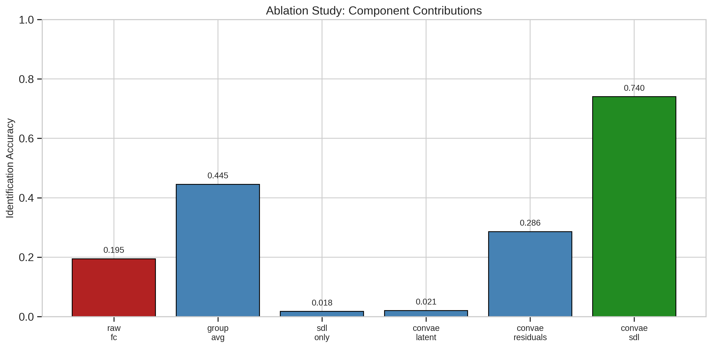
- **Robustness:** 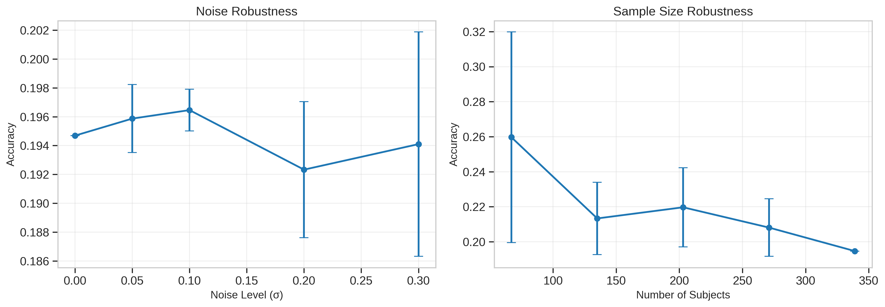
- **Atoms:** 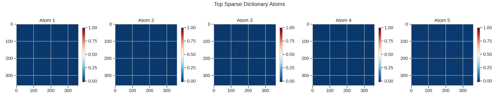
- **Sim Dist:** 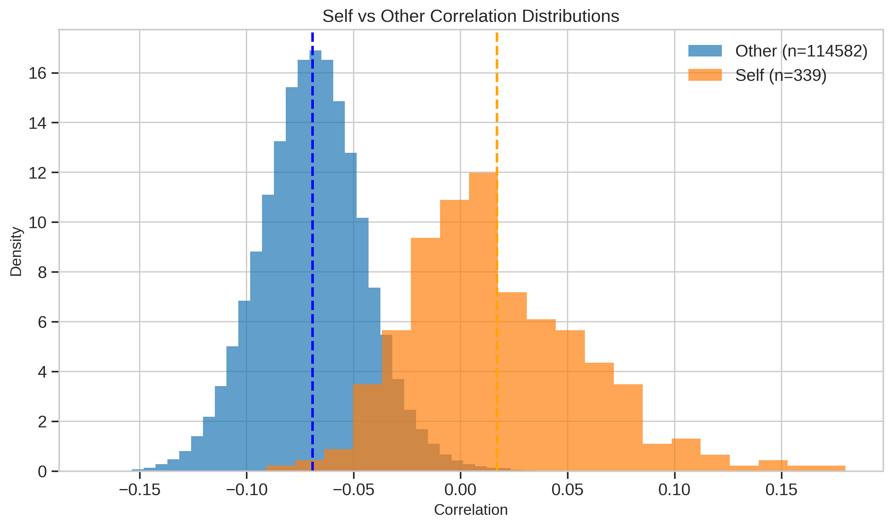

---

### 3.5 Task: GAMBLING
#### A. Comprehensive Metrics
| Metric | Value |
|---|---|
| Top-1 Accuracy | 0.7139 |
| Top-3 Accuracy | 0.8201 |
| Top-5 Accuracy | 0.8673 |
| Top-10 Accuracy | 0.9115 |
| Mean Rank | 6.33 |
| Mean Reciprocal Rank | 0.7816 |
| Differential Identifiability | 0.0933 |

#### B. Ablation Study
| Method | Accuracy | Top-5 | MRR |
|---|---|---|---|
| raw_fc | 0.2714 | 0.4130 | 0.3437 |
| group_avg | 0.5428 | 0.7345 | 0.6280 |
| sdl_only | 0.0177 | 0.0678 | 0.0510 |
| convae_latent | 0.0531 | 0.1298 | 0.0963 |
| convae_residuals | 0.4041 | 0.5664 | 0.4849 |
| convae_sdl | 0.7139 | 0.8673 | 0.7816 |

#### C. State-of-the-Art Comparison
| Method | Accuracy |
|---|---|
| finn_2015 | 0.3230 |
| edge_sel_5pct | 0.2507 |
| edge_sel_10pct | 0.2920 |
| edge_sel_20pct | 0.3127 |
| proposed | 0.7139 |

#### D. Statistical Validation
| Test | Result | Interpretation |
|---|---|---|
| Bootstrap Mean | 0.1879 +/- 0.0131 | Stability of the mean |
| 95% CI | [0.1622, 0.2139] | Reliability range |
| Permutation Test | 0.001996 | **Significant** (p < 0.05) |
| McNemar Test | 0.000000 | **Significant** (p < 0.05) |

#### E. Robustness Analysis
**Noise Robustness:**
| Noise Level (Sigma) | Accuracy |
|---|---|
| sigma=0 | 0.2714 +/- 0.0000 |
| sigma=0.05 | 0.2714 +/- 0.0000 |
| sigma=0.1 | 0.2702 +/- 0.0014 |
| sigma=0.2 | 0.2737 +/- 0.0066 |
| sigma=0.3 | 0.2755 +/- 0.0030 |

**Sample Size Robustness:**
| Sample Size (N) | Accuracy |
|---|---|
| N=67 | 0.4030 +/- 0.0597 |
| N=135 | 0.3081 +/- 0.0197 |
| N=203 | 0.3044 +/- 0.0212 |
| N=271 | 0.2908 +/- 0.0129 |
| N=339 | 0.2714 +/- 0.0000 |

#### F. Visualizations
- **Reconstruction Similarity Matrix:** 
- **Ablation Study:** 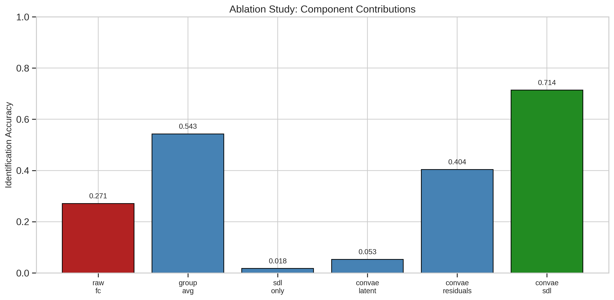
- **Robustness:** 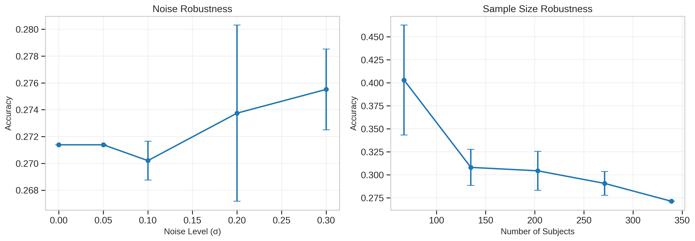
- **Atoms:** 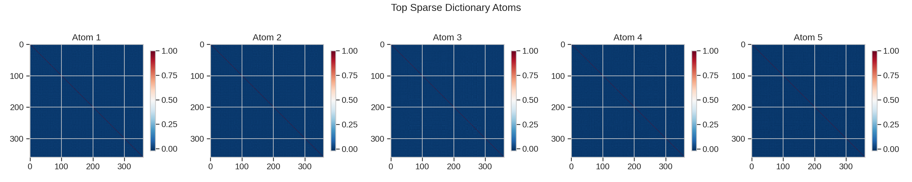
- **Sim Dist:** 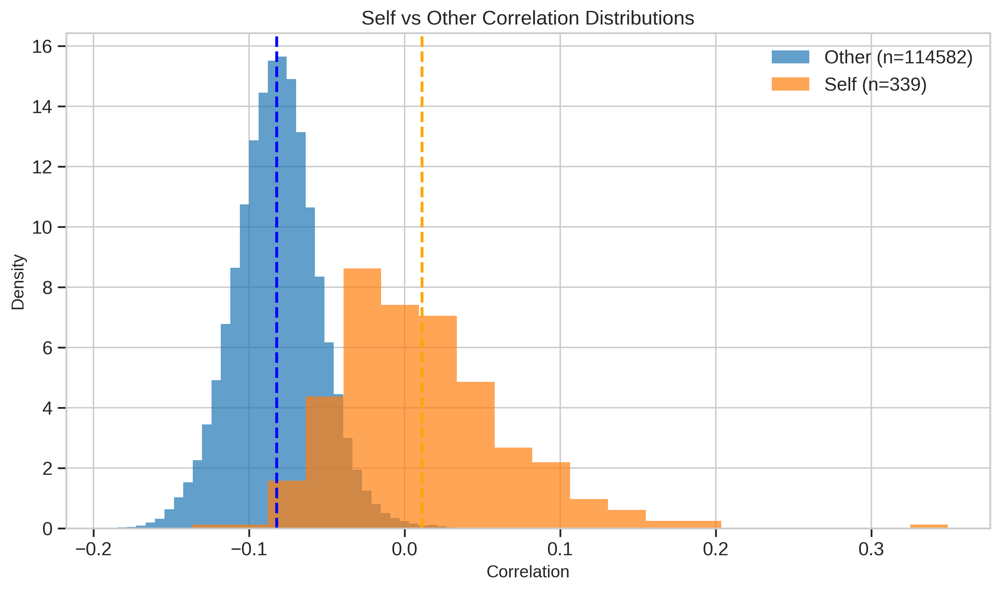

---

### 3.6 Task: LANGUAGE
#### A. Comprehensive Metrics
| Metric | Value |
|---|---|
| Top-1 Accuracy | 0.8201 |
| Top-3 Accuracy | 0.8968 |
| Top-5 Accuracy | 0.9204 |
| Top-10 Accuracy | 0.9558 |
| Mean Rank | 4.35 |
| Mean Reciprocal Rank | 0.8658 |
| Differential Identifiability | 0.0978 |

#### B. Ablation Study
| Method | Accuracy | Top-5 | MRR |
|---|---|---|---|
| raw_fc | 0.3186 | 0.4336 | 0.3812 |
| group_avg | 0.5782 | 0.6932 | 0.6412 |
| sdl_only | 0.0177 | 0.0619 | 0.0513 |
| convae_latent | 0.0472 | 0.1180 | 0.0918 |
| convae_residuals | 0.4100 | 0.5575 | 0.4849 |
| convae_sdl | 0.8201 | 0.9204 | 0.8658 |

#### C. State-of-the-Art Comparison
| Method | Accuracy |
|---|---|
| finn_2015 | 0.3510 |
| edge_sel_5pct | 0.2153 |
| edge_sel_10pct | 0.2478 |
| edge_sel_20pct | 0.2891 |
| proposed | 0.8201 |

#### D. Statistical Validation
| Test | Result | Interpretation |
|---|---|---|
| Bootstrap Mean | 0.2123 +/- 0.0140 | Stability of the mean |
| 95% CI | [0.1829, 0.2389] | Reliability range |
| Permutation Test | 0.001996 | **Significant** (p < 0.05) |
| McNemar Test | 0.000000 | **Significant** (p < 0.05) |

#### E. Robustness Analysis
**Noise Robustness:**
| Noise Level (Sigma) | Accuracy |
|---|---|
| sigma=0 | 0.3186 +/- 0.0000 |
| sigma=0.05 | 0.3180 +/- 0.0012 |
| sigma=0.1 | 0.3192 +/- 0.0012 |
| sigma=0.2 | 0.3174 +/- 0.0044 |
| sigma=0.3 | 0.3215 +/- 0.0032 |

**Sample Size Robustness:**
| Sample Size (N) | Accuracy |
|---|---|
| N=67 | 0.4090 +/- 0.0539 |
| N=135 | 0.3319 +/- 0.0217 |
| N=203 | 0.3557 +/- 0.0240 |
| N=271 | 0.3218 +/- 0.0075 |
| N=339 | 0.3186 +/- 0.0000 |

#### F. Visualizations
- **Reconstruction Similarity Matrix:** 
- **Ablation Study:** 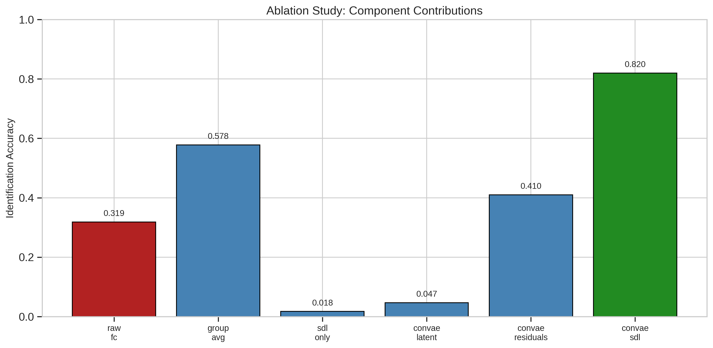
- **Robustness:** 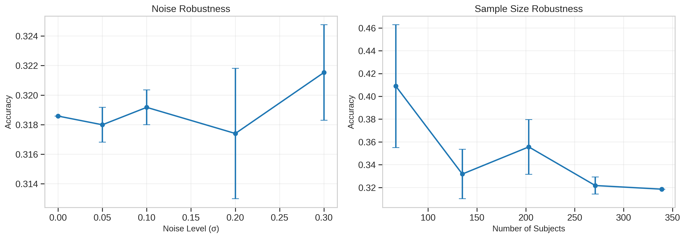
- **Atoms:** 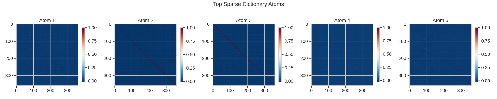
- **Sim Dist:** 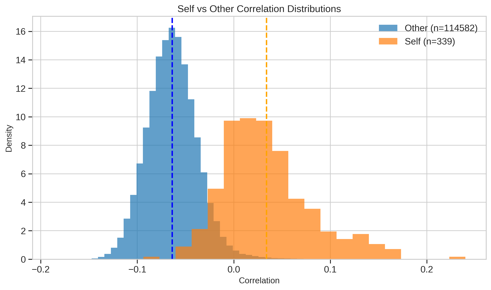

---

### 3.7 Task: RELATIONAL
#### A. Comprehensive Metrics
| Metric | Value |
|---|---|
| Top-1 Accuracy | 0.6844 |
| Top-3 Accuracy | 0.7906 |
| Top-5 Accuracy | 0.8466 |
| Top-10 Accuracy | 0.9027 |
| Mean Rank | 5.83 |
| Mean Reciprocal Rank | 0.7587 |
| Differential Identifiability | 0.0844 |

#### B. Ablation Study
| Method | Accuracy | Top-5 | MRR |
|---|---|---|---|
| raw_fc | 0.1976 | 0.3304 | 0.2727 |
| group_avg | 0.4631 | 0.6342 | 0.5484 |
| sdl_only | 0.0147 | 0.0324 | 0.0399 |
| convae_latent | 0.0295 | 0.0649 | 0.0637 |
| convae_residuals | 0.2802 | 0.4543 | 0.3680 |
| convae_sdl | 0.6844 | 0.8466 | 0.7587 |

#### C. State-of-the-Art Comparison
| Method | Accuracy |
|---|---|
| finn_2015 | 0.2301 |
| edge_sel_5pct | 0.1593 |
| edge_sel_10pct | 0.1770 |
| edge_sel_20pct | 0.2153 |
| proposed | 0.6844 |

#### D. Statistical Validation
| Test | Result | Interpretation |
|---|---|---|
| Bootstrap Mean | 0.1416 +/- 0.0141 | Stability of the mean |
| 95% CI | [0.1150, 0.1711] | Reliability range |
| Permutation Test | 0.001996 | **Significant** (p < 0.05) |
| McNemar Test | 0.000000 | **Significant** (p < 0.05) |

#### E. Robustness Analysis
**Noise Robustness:**
| Noise Level (Sigma) | Accuracy |
|---|---|
| sigma=0 | 0.1976 +/- 0.0000 |
| sigma=0.05 | 0.1976 +/- 0.0000 |
| sigma=0.1 | 0.2012 +/- 0.0012 |
| sigma=0.2 | 0.1971 +/- 0.0051 |
| sigma=0.3 | 0.2006 +/- 0.0032 |

**Sample Size Robustness:**
| Sample Size (N) | Accuracy |
|---|---|
| N=67 | 0.3403 +/- 0.0585 |
| N=135 | 0.2667 +/- 0.0366 |
| N=203 | 0.2325 +/- 0.0250 |
| N=271 | 0.2089 +/- 0.0125 |
| N=339 | 0.1976 +/- 0.0000 |

#### F. Visualizations
- **Reconstruction Similarity Matrix:** 
- **Ablation Study:** 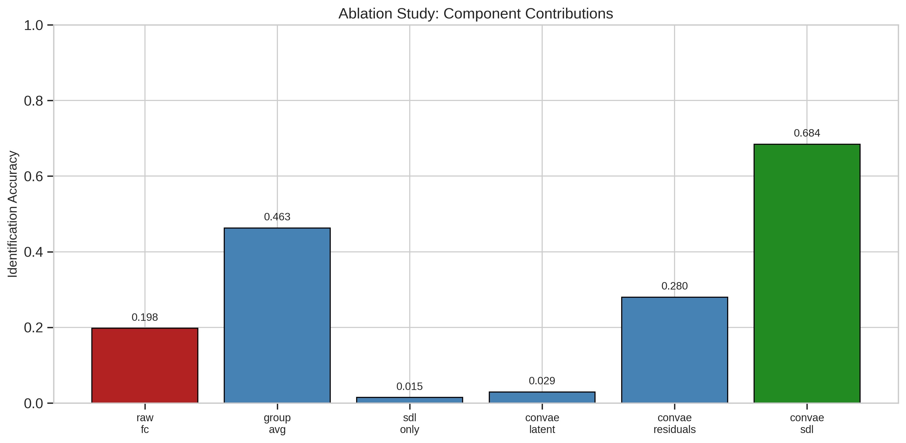
- **Robustness:** 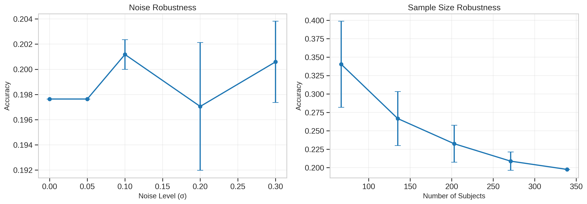
- **Atoms:** 
- **Sim Dist:** 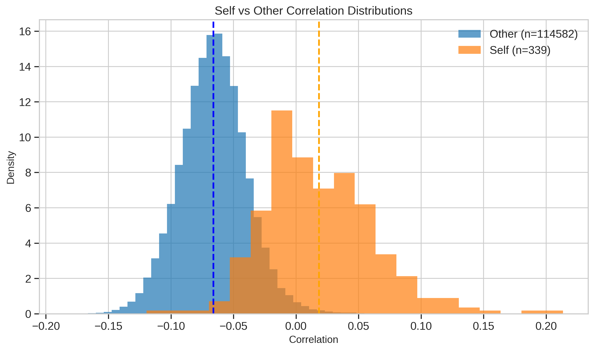
