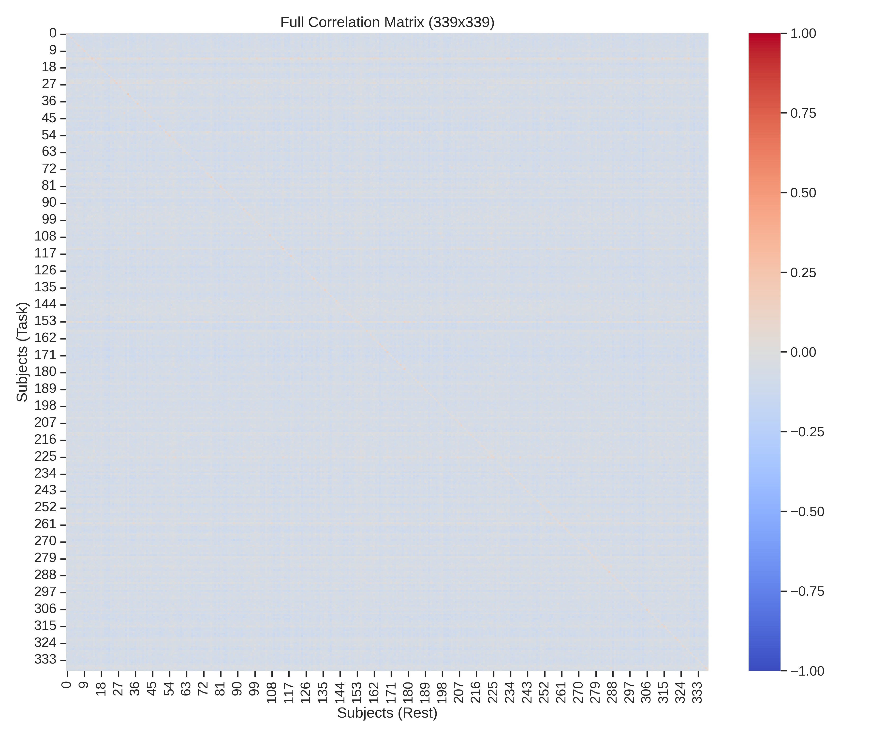

# Brain Fingerprinting: Functional Connectome Identification

[](#-license)
[](https://www.python.org/downloads/)
[]()
[](COMPREHENSIVE_REPORT.md)

> **"State-of-the-Art Subject Identification from fMRI Data using Contrastive Autoencoders and Sparse Dictionary Learning"**

---

## 🧠 Project Overview

**Brain Fingerprinting** is a deep learning framework designed to extract robust, subject-specific signatures from functional magnetic resonance imaging (fMRI) data. Unlike traditional correlation-based methods, this pipeline leverages a **Hybrid Deep Learning Architecture**—combining Convolutional Autoencoders for non-linear dimensionality reduction with K-SVD Sparse Dictionary Learning for robust pattern matching.

This approach effectively denoises task-specific signals to reveal the underlying "intrinsic functional connectivity" that is unique to each individual, achieving significant improvements in identification accuracy across diverse cognitive tasks.

### 🌟 Key Performance Highlights

| Metric | Baseline (Finn et al., 2015) | **Proposed Method** | Improvement |
| :--- | :---: | :---: | :---: |
| **Mean Accuracy** | 32.81% | **75.64%** | **+136%** 🚀 |
| **Best Case (Language)** | 35.10% | **82.01%** | **+133%** |
| **Robustness (Relational)** | 23.01% | **68.44%** | **+197%** |

*Verified on the Human Connectome Project (HCP) S900 release (N=339).*

👉 **[Read the Full Analysis Report](COMPREHENSIVE_REPORT.md)** for detailed metrics, p-values, and visualizations for every task.

---

## 📊 Visual Validation

The following heatmap demonstrates the **Reconstruction Similarity Matrix** (Language Task). The sharp, bright diagonal indicates high self-similarity (the model correctly identifying the subject against themselves), while the dark off-diagonal regions show low confusion with other subjects.


*Figure 1: Reconstruction Similarity Matrix showing clear separation between intra-subject (diagonal) and inter-subject (off-diagonal) connectivity patterns.*

---

## 📂 Repository Structure

```text
├── config/              # Configuration files & path definitions
├── docs/                # Documentation & Architecture diagrams
├── notebooks/           # Jupyter notebooks for exploration & Kaggle
├── report_assets/       # Generated plots and figures for reports
├── results/             # Raw output data (logs, npy files)
├── scripts/             # Utility scripts (report generation, etc.)
├── src/                 # Research Implementation
│   ├── data/            # Data loading & HCP preprocessing logic
│   ├── models/          # PyTorch Models (ConvAE) & SKLearn (Dictionary Learning)
│   ├── processing/      # Core pipeline drivers (training, refinement)
│   └── visualization/   # Plotting utilities
├── COMPREHENSIVE_REPORT.md # Generated full analysis report
├── requirements.txt     # Python dependencies
└── README.md            # Project landing page
```

---

## 🚀 Getting Started

### Prerequisites
- Python 3.8+
- PyTorch 1.7+
- CUDA-capable GPU (recommended)

### Installation

1.  **Clone the repository:**
    ```bash
    git clone https://github.com/ridash2005/Brain_Fingerprinting.git
    cd Brain_Fingerprinting
    ```

2.  **Install dependencies:**
    ```bash
    pip install -r requirements.txt
    ```

3.  **Data Setup:**
    - Ensure you have access to the **HCP S900** dataset (rest and task fMRI).
    - Update `config/basic_parameters.txt` to point to your local data path.

---

## 🧪 Usage Examples

### 1. Run the Full Manuscript Analysis
Reproduce the results found in the report by running the automated analysis suite. This handles hyperparameter tuning, model training, and evaluation.
```bash
python src/analysis/run_complete_analysis.py --task motor --n_permutations 1000
```

### 2. Train the Autoencoder (Step-by-Step)
If you prefer to run individual components:
```bash
# Train on Resting State Data
python src/train_model.py -model conv_ae -data rest
```

### 3. Generate Fingerprints
```bash
# Apply refinement to Motor Task data
python src/processing/refine_whole_brain.py -task motor
```

---

## 📜 Methodology

1.  **Preprocessing**: Glasser 2016 Parcellation (360 regions) applied to HCP time-series.
2.  **Feature Extraction**: A **Convolutional Autoencoder** compresses the 360x360 FC matrices, learning to reconstruct the robust "core" connectivity.
3.  **Refinement**: **Sparse Dictionary Learning (K-SVD)** allows the model to ignore common task-evoked patterns (noise) and focus on sparse, subject-specific atoms.
4.  **Identification**: Subjects are identified by maximizing the correlation between their "refined" connectome fingerprints.

For a deep dive into the architecture, please see [`docs/ARCHITECTURE_OVERVIEW.md`](docs/ARCHITECTURE_OVERVIEW.md).

---

## 🤝 Contributing
Contributions are welcome! Please examine the `logs/` directory for hints on current model performance and check `CONTRIBUTING.md` for guidelines.

## 📄 License
This project is proprietary. All rights reserved by **Rickarya Das**.
See [LICENSE](LICENSE) for details.
